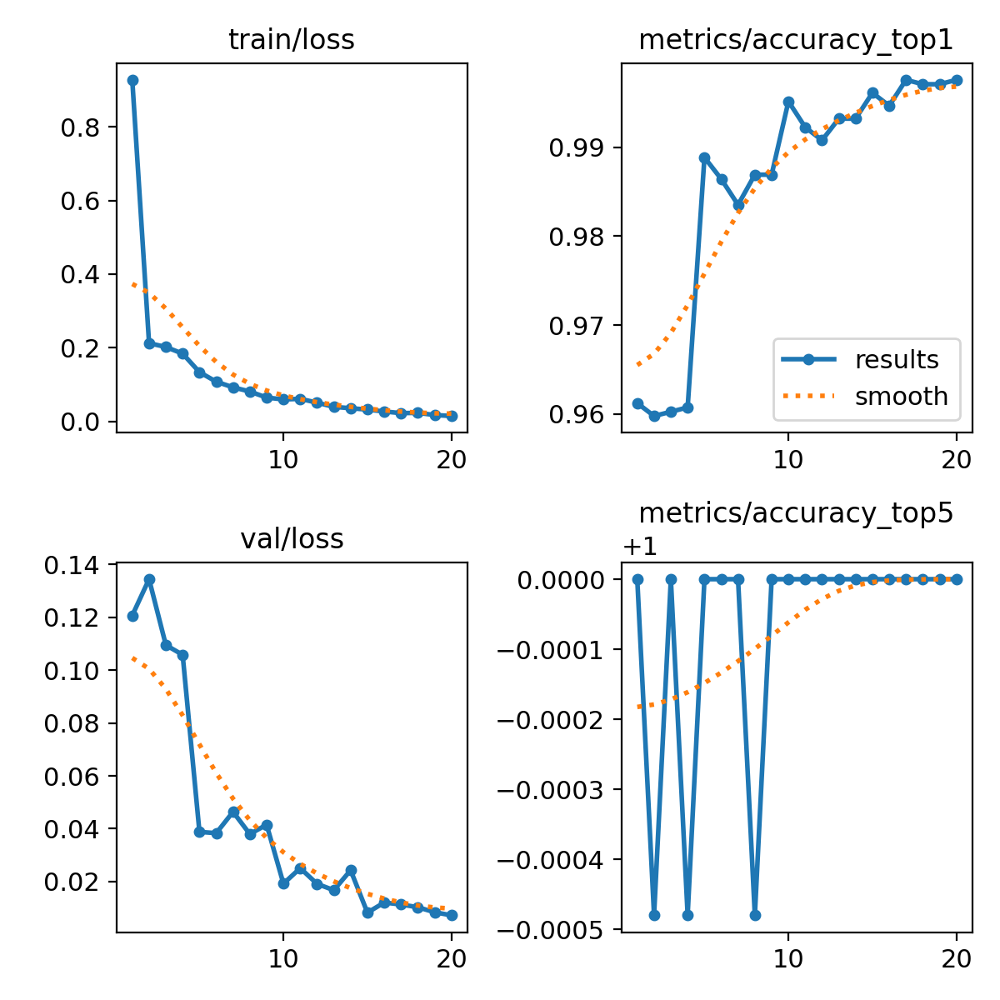
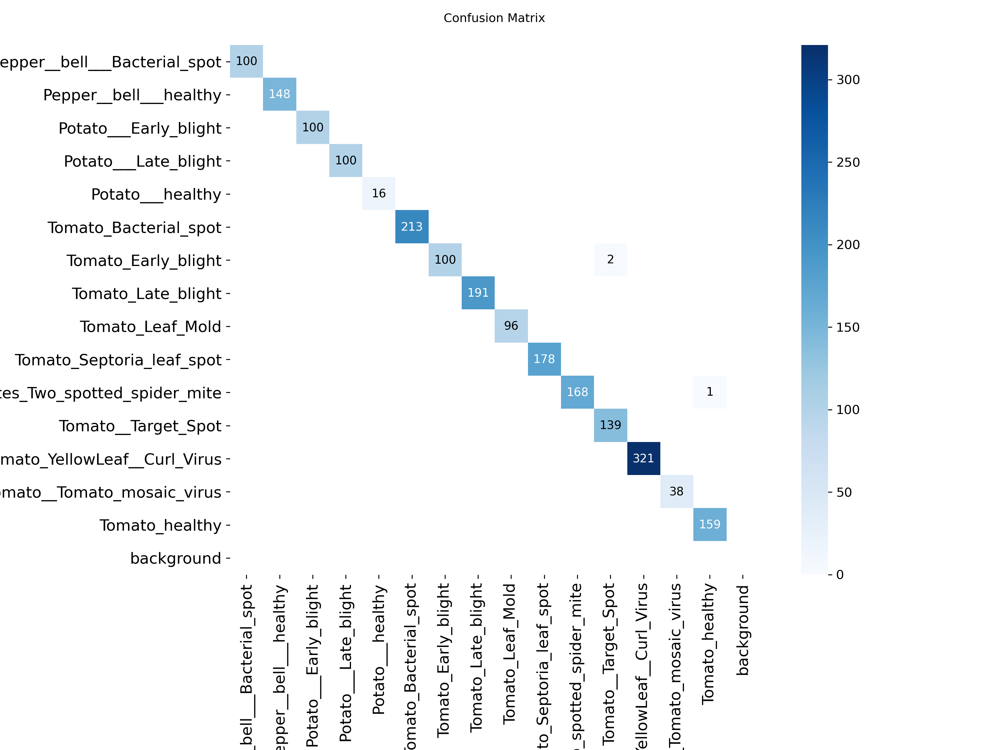
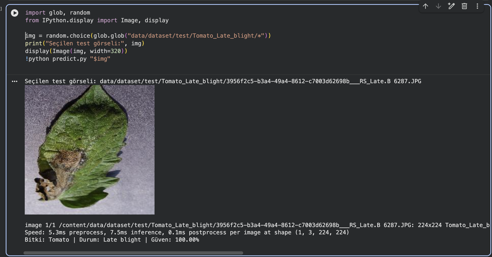
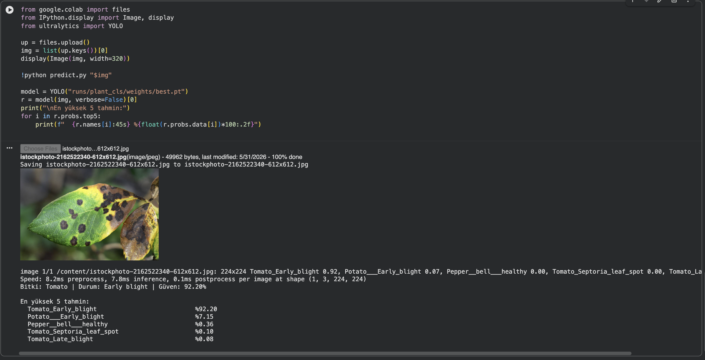

# Yaprak Hastalığı Sınıflandırma (PlantVillage + YOLO11)

Yaprak fotoğrafından bitkiyi ve hastalığını (ya da sağlıklı olduğunu) tahmin eden
bir görüntü sınıflandırma projesi.

Veri setindeki sınıf adları `Bitki_Hastalık` biçiminde olduğu için
(`Tomato_Late_blight`, `Potato_healthy` ...) tek bir sınıflandırma modeli her iki
bilgiyi de verir: model bir sınıf tahmin eder, çıktıda bu ad bitki ve hastalık
olarak ayrıştırılır.

- Model: Ultralytics YOLO11-cls (`yolo11s-cls.pt` üzerinden fine-tune)
- Veri: [PlantVillage](https://www.kaggle.com/datasets/emmarex/plantdisease) — 15 sınıf, ~20.000 görsel (domates, biber, patates)
- Giriş boyutu: 224x224

## Sonuçlar

| Metrik | Değer |
|---|---|
| Test Top-1 accuracy | % 99.86 |
| Test Top-5 accuracy | % 100.00 |
| Macro F1 / Weighted F1 | 0.9985 / 0.9986 |
| Test görsel sayısı | 2070 (15 sınıf) |

2070 test görselinden yalnızca yaklaşık 3 tanesi yanlış sınıflandı.

### Eğitim eğrileri (loss + accuracy)


### Confusion matrix


### evaluate.py çıktısı (test bölmesi)
```
Top-1 accuracy: 0.9986
Top-5 accuracy: 1.0000

                                             precision    recall  f1-score   support
              Pepper__bell___Bacterial_spot     1.0000    1.0000    1.0000       100
                     Pepper__bell___healthy     1.0000    1.0000    1.0000       148
                      Potato___Early_blight     1.0000    1.0000    1.0000       100
                       Potato___Late_blight     1.0000    1.0000    1.0000       100
                           Potato___healthy     1.0000    1.0000    1.0000        16
                      Tomato_Bacterial_spot     1.0000    1.0000    1.0000       213
                        Tomato_Early_blight     0.9804    1.0000    0.9901       100
                         Tomato_Late_blight     1.0000    1.0000    1.0000       191
                           Tomato_Leaf_Mold     1.0000    1.0000    1.0000        96
                  Tomato_Septoria_leaf_spot     1.0000    1.0000    1.0000       178
Tomato_Spider_mites_Two_spotted_spider_mite     0.9941    1.0000    0.9970       168
                        Tomato__Target_Spot     1.0000    0.9858    0.9929       141
      Tomato__Tomato_YellowLeaf__Curl_Virus     1.0000    1.0000    1.0000       321
                Tomato__Tomato_mosaic_virus     1.0000    1.0000    1.0000        38
                             Tomato_healthy     1.0000    0.9938    0.9969       160
                                   accuracy                         0.9986      2070
```

Hataların tamamı domates sınıfları arasında: en çok `Target_Spot` ile
`Early_blight` karıştı (yaprak üzerindeki kahverengi leke desenleri benzer). Daha
ayrıntılı yorum: [SONUCLAR.md](SONUCLAR.md)

### Örnek tahminler (predict.py)

**Test setinden (temiz lab görseli):** Görsel modelin eğitildiği dağılımdan
(in-distribution) olduğu için tahmin ~%100 güvenle yapılıyor.

Tomato — Late blight


**Gerçek dünya (saha) görseli — modelin genelleme sınırı:** İnternetten alınan,
doğal arka planlı bir yaprak. Model yine en olası sınıfı buluyor ama güven %100'den
**%92.20**'ye düşüyor ve olasılığın bir kısmını yakın bir sınıfa dağıtıyor
(Potato Early blight %7.15). Yani sadece temiz lab görselleriyle eğitilen model,
saha görsellerinde daha temkinli/belirsiz davranıyor.



## Kurulum ve çalıştırma

```bash
pip install -r requirements.txt

# Veriyi indir ve aç
kaggle datasets download -d emmarex/plantdisease
mkdir -p data/raw && unzip -q plantdisease.zip -d data/raw

# Böl -> eğit -> değerlendir
python prepare_data.py   # %80 train / %10 val / %10 test (ImageNet klasör düzeni)
python train.py          # yolo11s-cls fine-tune -> runs/plant_cls/weights/best.pt
python evaluate.py       # Top-1/Top-5 + sınıf bazlı rapor + confusion matrix

# Tek görsel tahmini
python predict.py yaprak.jpg
```

Eğitim Google Colab'da T4 GPU ile ~0.64 saat sürdü. GPU yoksa epoch sayısı düşürülebilir.

## Proje yapısı

```
prepare_data.py          ham PlantVillage'ı train/val/test'e böler (seed=42)
train.py                 yolo11s-cls fine-tune (imgsz=224, 20 epoch)
evaluate.py              test Top-1/Top-5 + classification_report
predict.py               tek görsel -> "Bitki | Durum | Güven"
requirements.txt
SONUCLAR.md              sonuç raporu ve yorum
runs/plant_cls/
  weights/best.pt        eğitilmiş model
  results.png            eğitim eğrileri
  confusion_matrix.png
```

## Model hakkında

YOLO11s-cls bir evrişimli sinir ağıdır (CNN): 47 katman, ~5.45M parametre, 12.0 GFLOPs.
Giriş görselleri 224x224'e yeniden boyutlandırılır. Convolution katmanları stride ile
özellik haritalarını küçültür (downsampling) ve derinleştikçe daha soyut özellikler
öğrenilir; sondaki sınıflandırma katmanı 15 sınıf için olasılık üretir. Eğitim,
ImageNet üzerinde önceden öğrenilmiş ağırlıklardan başlatılarak (transfer learning)
bu 15 sınıfa uyarlanmıştır.
